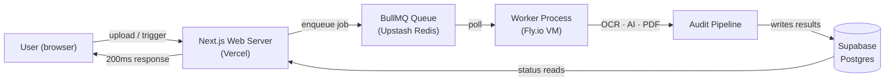
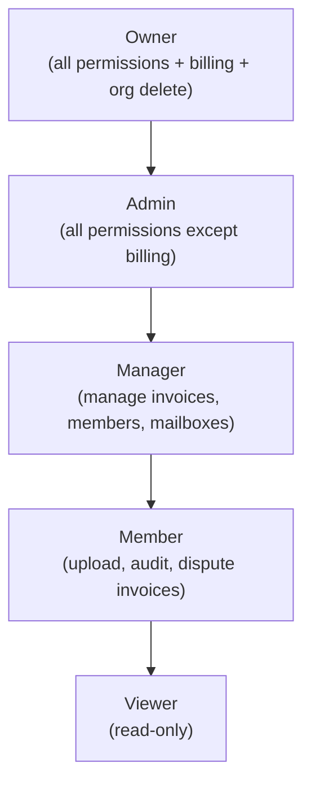
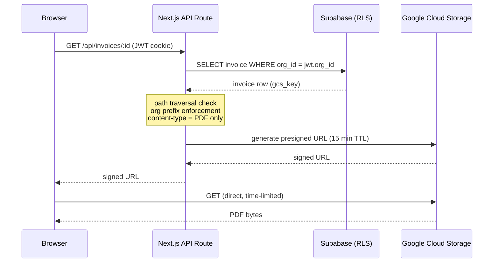
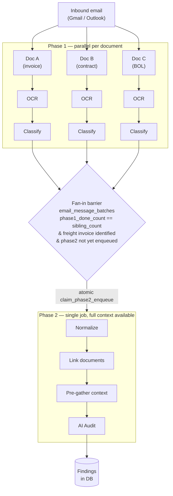
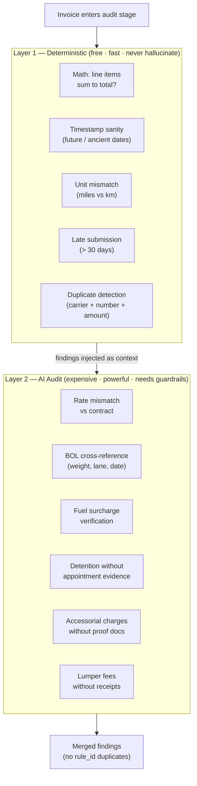

# Sifter — Technical Deep-Dive

---

## 1. The Problem

There are multiple companies spending millions per year on freight — F&B, aggregates, manufacturers. Their AP teams need to manually review invoices from multiple sources and formats, and they often bypass the audit step because it's too time-consuming and error-prone. The checklist for reviewing a carrier invoice is long.

Enterprises have access to TMS, EDI, and structured data for seamless audit. SMBs don't. Cass requires companies to have at least $50M spent on freight per year to be eligible to use their software. Below that line, you're on your own.

AI can bridge the gap — ingesting unstructured, messy data to automate a boring but costly process. If nobody builds this, companies with already-thin margins keep getting overcharged.

**The target customer:** aggregate companies running around 200 trucks — maybe 500–1,500 loads a month. Real freight spend, nowhere near the Cass threshold.

**What makes manual audit break:** Accessorial charges are the hardest — you have to pull contracts, check BOLs for timing and detention windows, cross-reference everything. And duplicates are a recall problem: nobody can remember every invoice they've already paid.

---

## 2. Architecture Decisions

### 2.1 Web server does almost no real work — everything offloaded to background workers

**The constraint:** The audit pipeline is the product's moat, and it will change constantly. The web server changes on a different cadence — bug fixes, UI tweaks, settings pages. Coupling them in the same process means every pipeline deploy risks taking down the app.

**Why a queue boundary, not just a function call boundary:**

1. **Request timeouts aren't negotiable.** An audit takes 90+ seconds. You can't make a user stare at a spinner. A queue means the user gets a response in 200ms and the work continues on its own clock.

2. **Retry logic without a queue is fragile.** If a step fails mid-pipeline — AI call errors, PDF corrupted, lookup timeout — in a synchronous world, you've lost everything. The user has to re-upload. With a queue, the failed step retries with backoff. The job's state is durable.

3. **Load shaping.** When 80 invoices land at once, a synchronous pipeline means 80 concurrent AI calls competing for the same resources. A queue controls parallelism. The web server stays responsive.

4. **Independent deploy velocity.** The pipeline can be deployed 10 times a week without the web server ever knowing. Different cadences, different risk profiles.

5. **Different hardware profiles.** Web server is lightweight (HTML, JSON). Pipeline stages are heavy (OCR, AI inference, PDF generation). They want different instance types. A queue is the natural seam.

**Lesson:** A function call boundary is about code organization. A queue boundary is about time, failure, and independent evolution. They solve different problems.

### 2.2 KMS-encrypted credentials before they touch the database

**The stake:** OAuth tokens for Gmail and Outlook connections. If someone gets unauthorized access to the database — leaked `service_role` key, misconfigured backup bucket, SQL injection — they've got every OAuth token. With those tokens, they can read every connected mailbox, send email as that user, exfiltrate invoices, tamper with supplier communications.

**The fix:** KMS encryption at the application layer. Credentials are encrypted before the INSERT statement. The database holds ciphertext it can't read. The application decrypts only in memory, only when a worker needs to impersonate a user.

**What this means in practice:** Even with a full database dump, the attacker gets ciphertext. They'd need to also compromise the KMS — a separate system, separate auth, separate audit log. The blast radius shrinks to: rotate the KMS key, invalidate old ciphertext, ask affected customers to re-authenticate. A bad day, not a business-ending event.

**Lesson:** The database should hold secrets it can't read. Encrypt at the application layer, not the database layer — if an attacker has a valid DB session, `SELECT decrypt(column)` works. An external KMS means the database alone is never enough.

### 2.3 RLS on every table

Every one of 22 tables has Row Level Security enabled. Most are scoped by `auth.jwt() ->> 'org_id' = org_id`. Sensitive tables (OAuth tokens, job state, cost operations) have no policies at all — only the service role can read them. Authenticated users get zero rows, period.

**Why not just do org-scoping in application code:** App-level auth checks are a single point of failure. One route forgets `eq('org_id', orgId)` — maybe one written at 11pm, maybe one refactored by someone who doesn't know the pattern — and you've got a cross-tenant data leak. RLS makes org filtering non-optional. The database is the final authority on who can read what, because the application is written by tired humans.

**Lesson:** Make the database the enforcer, not the application. Defense in depth — both layers have to fail for data to leak.

### 2.4 Five-tier RBAC with hardcoded roles

Five tiers: owner, admin, manager, member, viewer. Each role has a hardcoded set of permissions. No per-user toggles, no dynamic grants.

**Why hardcoded:** Per-user permission toggles are a trap in an MVP. They solve a problem that doesn't exist at this stage — a 3-person AP team doesn't need granular overrides. They create hidden costs: every check becomes a DB lookup, admin panels need custom UI, support tickets become "why can't I do X?", and testing permutations explode (5 roles vs. 1,024 boolean flag combinations).

**The escape hatch:** If a customer with 200 AP people needs custom roles later, the interface is `requirePermission(role, permission)` backed by a simple `Record<MemberRole, ReadonlySet<Permission>>`. Adding a 6th role or making roles configurable is a one-place change.

**Lesson:** Model the world as it is, not as it might become. Roles map to how teams actually work; per-user toggles map to how engineers wish teams worked.

### 2.5 CSP headers and the no-cache bug

**CSP:** `frame-ancestors 'none'` blocks clickjacking — someone embeds the real app in an invisible iframe on a lookalike domain. `object-src 'none'` closes legacy plugin vectors. No `unsafe-eval` in production shrinks XSS blast radius — even if an attacker injects JavaScript, the browser blocks dynamic code evaluation. GCS domain whitelisted in `frame-src` so the PDF viewer works.

**The no-cache bug:** During testing, I switched orgs and navigated to a document page using an ID from the previous org. The document still showed. The browser's HTTP cache keys by URL, not by cookies. Supabase uses cookies for auth, not `Authorization` headers. So `GET /api/invoices/abc123` is the same cache key whether logged in as Org A or Org B — the browser served Org A's cached response while authenticated as Org B. Every auth check passed. RLS was fine. The browser leaked data at a layer below all of it.

**Fix:** `Cache-Control: no-store, must-revalidate` on every multi-tenant API response.

**Lesson:** Multi-tenancy is a property of the whole stack, not just the database. The browser has state you didn't write, and it doesn't know your security model.

### 2.6 GCS presigned URL flow

Files are private in GCS. Nobody hits GCS directly. The flow:

1. Authenticate user and resolve org
2. Look up invoice in DB, scoped by `org_id` from JWT
3. Take the `gcs_key` from the DB row
4. Generate a presigned URL (1–60 minute expiry)

The presigned URL utility has three safety checks: path traversal block (rejects `..` and `//`), org prefix enforcement (`orgs/{orgId}/` must be the key prefix), and content-type check (only signs URLs for PDFs). A leaked signed URL expires in 15 minutes by default.

### 2.7 The two-phase AI audit pipeline

**The mistake that led to it:** Originally had a single pipeline where one worker could process multiple documents per run. The problem: contracts and invoices often arrive in the same email. The invoice needs the contract's rates already in the database to do a meaningful audit. In a single pipeline, both documents race — and if the invoice finishes first, the AI audits without contract context. Garbage findings.

**The fix — two phases with a fan-in barrier:**

Phase 1: OCR → classify. Runs per document. No ordering constraints — all documents in a batch run in parallel.

Phase 2: Normalize → link → pre-gather → audit. Only enqueued when ALL documents from the same email have completed Phase 1 and a freight invoice has been identified.

**How the fan-in barrier works:**

1. `email_message_batches` table tracks each email: `sibling_count` (how many docs), `phase1_done_count` (how many finished), `freight_invoice_document_id` (which one is the invoice), `phase2_enqueued` (don't double-fire).

2. After each document finishes Phase 1, `increment_batch_phase1` (a Postgres RPC) atomically increments the done count and optionally sets the invoice doc ID. One atomic UPDATE — no races.

3. `shouldEnqueuePhase2` checks: all siblings done? Invoice identified? Phase 2 not already enqueued? If yes, `claim_phase2_enqueue` atomically flips the flag. Only one worker wins the race.

4. The winner enqueues Phase 2. By then, every document's data is in the database — contracts, BOLs, rate sheets. The audit runs against a complete picture.

**What about re-audit:** If a supporting document (contract, BOL) arrives later in the same email thread, the system detects a previously audited invoice in the thread, clears its findings, and re-runs Phase 2 with the new context.

**Lesson:** When order matters between independent work items, don't try to enforce ordering inside the pipeline. Fan everything in, count to N, and only proceed when all N are done.

### 2.8 The quality gate: deterministic checks before AI

Phase 2's audit stage has two layers, run in strict order:

**Layer 1 — Deterministic checks (free, fast, never hallucinate):**
- Math error: do line items sum to the invoice total?
- Timestamp sanity: is the invoice dated 30 days in the future? 2 years in the past?
- Unit mismatch: are miles and kilometers mixed in line descriptions?
- Late submission: received more than 30 days after invoice date?
- Duplicate detection: same carrier + invoice number + amount already cleared?

**Layer 2 — AI audit (expensive, powerful, needs guardrails):**
- Rate mismatch against contracted rate sheets
- BOL cross-referencing (weight, lanes, dates)
- Fuel surcharge percentage verification
- Detention without appointment evidence
- Accessorial charges without proof documents
- Lumper fees without receipts

**Why the order matters beyond cost:** The deterministic findings feed into the AI as context. The AI prompt says "do not duplicate rule_ids already in deterministic findings." The LLM isn't wasting tokens on things code already caught. And a deterministic finding combined with an AI finding can be a stronger signal — "math is off by $600 AND there's a suspicious accessorial for $600" is more than either alone.

**Idempotency:** Before running, the audit checks if findings already exist for this invoice. If yes, return — this job was already done. The re-audit path explicitly deletes old findings first, so idempotency doesn't block a legitimate do-over.

**Lesson:** Code before AI. Determinism where you can get it, judgment where you can't. Never pay the LLM to check arithmetic.

### 2.9 Persistent VMs (Fly.io) over serverless for workers

**The question isn't "what's the cheapest compute?" — it's "what failure mode can I live with?"**

**Option 1: Lambda / Cloud Run.** Pay per invocation, zero when idle. But BullMQ workers aren't HTTP handlers — they're long-lived processes polling Redis. Rewriting the worker model costs retry, backoff, and concurrency control. Phase 2 jobs run 5–10 minutes — near the timeout ceiling and racing against it. Redis connections don't survive cold starts; dropped connections mean expired locks, double-processing, silent corruption.

**Option 2: Vercel Functions / Fluid Compute.** Same platform as the app keeps ops simple. 300s timeout is better. But the process model is still HTTP request/response — running a persistent queue consumer inside it fights the platform. And it couples worker resources to the web server's platform, undoing the whole point of the queue separation.

**Option 4: Fly.io VMs (what I chose).** One persistent machine, one Node.js process, one Redis connection held open. BullMQ worker polls, manages concurrency, holds job locks. No timeout ceiling — a 10-minute audit finishes because nobody kills the process at minute 9. The VM costs money idle or not.

**Tradeoff accepted:** I pay for idle compute instead of scaling to zero. But the alternative — debugging a dropped job because a Lambda cold start lost a Redis lock — costs more. When the pipeline IS the product, idle servers are insurance, not waste.

**Lesson:** Serverless optimizes for "zero when idle." Persistent VMs optimize for "the job finishes." When the job is your product, prioritize the job.

---

## 3. Mistakes and What I Learned

### 3.1 The Inngest rip-out

I built the entire pipeline on Inngest first. Seven functions, each triggered by events: `sifter/document.received` → OCR → classify → normalize → gather-context → post-audit. Each stage emitted an event to wake up the next. 2,390 lines of pipeline code.

It worked for single documents. Then I hit the case where one email has multiple attachments — a contract and an invoice arriving together. The invoice needs the contract's data already in the database to do a meaningful audit. But Inngest has no native "wait for N of M events" primitive. There's no way to say "hold until all documents from this email batch have finished Phase 1, then proceed." The event model is fire-and-forget — each event triggers exactly one function. Fan-in — where N things all need to land before one thing starts — is the one pattern events can't express.

I could have built a workaround: a counter table, polling, timeouts, complexity on top of complexity. But at that point I'd be building a queue system on a workflow platform. The platform was fighting the problem.

BullMQ lets me just... not enqueue Phase 2 until I'm ready. The fan-in barrier is a database row with a counter and a claim — atomic, simple, exactly the right primitive. Inngest gave me durable execution between steps I didn't need separated. BullMQ gave me a single process where I control exactly when the next job fires.

**Lesson:** Event-driven workflows are great when steps are separated by time — "wait 3 days, then follow up." But "wait until all siblings are done, then immediately proceed" is a queue pattern, not a workflow pattern. Pick the tool that matches the shape of your problem, not the one with better marketing.

### 3.2 I did prompt engineering wrong for way too long

My workflow was: tweak the classify prompt, upload a document, wait 90 seconds for OCR + LLM, look at the output, tweak again, upload another document, wait again. One document at a time. I was optimizing for the document in front of me. The next document would break everything.

What I eventually learned: build an eval set first. Collect 50-100 real documents — invoices, BOLs, rate sheets, the messy ones carriers actually send. Label them with correct classification, key fields, and expected findings. This is ground truth. Run the prompt against the entire eval set in batch. Measure accuracy per field. Tweak the prompt. Re-run. Only ship when the numbers improve across the board, not just on the one document you're staring at.

The eval set forces you to confront edge cases systematically. What about a document that's both a delivery receipt and has line-item charges? What about a scanned invoice where the OCR butchers the carrier name? The eval set surfaces them because they're real documents in the set, not hypotheticals you thought of at 2am. You can't fool yourself into thinking a prompt works when 3 out of 50 documents fail — the numbers don't lie.

Once you have evals, you can also throw multiple prompt variants at the set and compare. You're not guessing whether "lean toward FREIGHT_INVOICE" is better than "if in doubt, classify as OTHER." You have data.

The document ambiguity problem compounds this. Real carriers send documents that blur the lines — a delivery receipt with charges at the bottom, a rate confirmation that looks like an invoice, a single PDF that's page 1 = invoice and page 2 = BOL. The classifier has to pick the primary intent, not the only intent. The classification gate — rejecting documents missing both carrier name and invoice number — catches the worst cases gracefully. Better to reject and flag for human review than to misclassify and produce garbage findings downstream.

**Lesson:** Prompt engineering without an eval set isn't engineering — it's alchemy. Build the eval set first, then iterate. And classification boundaries are fuzzy in the real world; design your gates to fail safe, not fail dangerous.

### 3.3 The single pipeline that would have shipped garbage

I built the original pipeline as a single phase. One job, one document, one run. It worked fine in testing with single documents. Then, before shipping, I asked Claude to do a deep-dive adversarial review of the entire project — not "does this code work?" but "what would fail if this went to real customers?"

Claude flagged it: when a contract and invoice arrive in the same email, they each get their own job. Those jobs run in parallel. The invoice job loads the carrier's rates from the database — but the contract job hasn't finished yet. The rates aren't there. The AI audits the invoice without the contract. The finding says "no rate sheet found for this carrier." That's not a real finding. That's a timing bug masquerading as an audit result.

If I'd shipped this, every multi-document email would produce unreliable audits. Invoices that should have been checked against contract rates would show "no contract available." Finding quality would degrade based on which job finished first — a race condition the user can't see and I can't reproduce.

The rewrite took 5 days: split the pipeline into Phase 1 (OCR + classify, parallel per document) and Phase 2 (normalize + link + audit, only after all documents are done), add the `email_message_batches` table, write the fan-in barrier with atomic Postgres RPCs, build the re-audit trigger for late-arriving supporting documents in the same thread.

5 days to catch and fix an architecture-level bug that would have eroded trust in every audit. 

**Lesson:** Code review catches bugs. Architecture review catches design flaws. Do both before you ship. A second set of eyes — human or AI — that reads your system as a whole can find the failure modes you're too close to see.

---

## 4. Production Lessons

### 4.1 The OpenAI outage that nobody noticed

OpenAI had a degraded API — 5xx errors, elevated latency. The audit pipeline started piling up failures. BullMQ retried with exponential backoff, which was the right call, but after 3 attempts each job landed in the dead letter queue. Nothing was watching the dead letter queue. Invoices sat in "processing" status for hours. Customers uploaded documents and heard nothing.

**What I added:** First, provider switching. If OpenAI fails too many times in a window, the audit agent switches to Gemini or Grok. The pipeline doesn't care which model runs the check — it just needs a result. Second, a monitor on queue depth — if the phase2 waiting count stays above a threshold for more than 15 minutes, it pages me. Third, a stuck-document alert — any document in "processing" status for more than 30 minutes triggers a notification. The dead letter queue is a triage list now, not a graveyard.

### 4.2 OAuth tokens expiring silently

A customer's Gmail refresh token was revoked — they changed their password and didn't think about Sifter. The sync cron kept running every 15 minutes. The per-connection try/catch meant the failure was swallowed for that one mailbox while others kept syncing. No error surfaced to the customer, no alert fired for me. That mailbox went dark for 5 days. No invoices from that connection. The customer thought their carriers were just slow — they weren't slow, the pipe was closed.

**What I added:** A "last successful sync" timestamp per mailbox. If a connection hasn't yielded a new message in more than 48 hours, the system flags it in the mailboxes tab: "This connection may need re-authentication." It also sends the customer an email nudge — I can't re-authenticate for them, but I can tell them it's broken before they discover it themselves. OAuth re-auth has to be done by the user. The job of the system is to notice the problem before the user does.

### 4.3 Worker OOM on monster PDFs

A customer uploaded a 200-page PDF with high-resolution scanned images. The OCR process tried to load the entire file into memory. The worker hit the Fly.io memory ceiling, got OOM-killed, and restarted. The job was lost mid-flight — no retry because the process died before reporting failure. Redis eventually released the lock when the TTL expired, another worker picked up the job, and also died. Loop until someone notices.

**What I added:** A file size limit at upload — anything over 50MB is rejected before it hits the pipeline. And a per-page memory budget in the OCR stage: PDFs over 100 pages are processed in chunks instead of loading the whole thing into memory at once.

### 4.4 Redis connection dropping and the silent queue backup

Upstash Redis had a brief network partition. The BullMQ worker lost its Redis connection. The worker process stayed alive — no crash, no exit, no restart trigger. It just sat there. The web server kept accepting uploads and enqueuing jobs. Queue depth grew. Nobody knew — nothing was processing, but nothing was erroring either.

**What I added:** A worker health check that pings Redis every 30 seconds. If the connection is dead for more than 2 minutes, the worker process exits and Fly.io restarts it. And a queue depth alert — if phase1 or phase2 waiting count crosses a threshold, page me.

**One-line lesson:** Monitor the absence of events, not just the presence of errors. A job that never fails and never succeeds is harder to detect than one that crashes.

---

## 5. AI-Augmented Development

### 5.1 How I actually built this

I used Claude Code, but not as a "build me an app" machine. The workflow was:

**1. Work backward from the product, not the AI.** I decide what the product should be. Claude doesn't drive — I drive. The AI helps me get there faster, but I'm the one who knows what "right" looks like. I generate test cases before any code is written, because tests mirror what I want the app to actually do. They're executable expectations.

**2. Spec first, code second.** I use the Superpowers skill in Claude Code to draft the clearest, most detailed specs possible. This isn't rubber-stamping — it's a conversation. Claude will flag confusion or gray areas I haven't thought of, and we iterate until the spec is unambiguous. The spec becomes the contract that implementation must satisfy.

**3. From spec to plan.** Once the spec is crystal clear, I work with Claude to turn it into a detailed implementation plan split by stage. Each stage has a defined scope, clear inputs and outputs, and doesn't overlap with other stages.

**4. Parallel dispatch to isolated worktrees.** When the plan is ready, I dispatch the build to multiple Claude agents working in isolated git worktrees — each agent gets its own copy of the repo so they don't conflict. I review every line they write. Once I've verified the code, I merge. No agent deploys without my review.

**5. The tools I relied on most:**
- **Context7** — keeps me current with library docs so I'm not coding against stale APIs
- **Vercel CLI** — quick staging environment spins up for testing before merge
- **Superpowers** — the structured workflow from spec → plan → dispatch → review
- **Agent Checklist** — tracks what each parallel agent is doing so nothing gets dropped

### 5.2 Where AI helped most

Architecture conversations. Not writing code — thinking through tradeoffs. "What happens if the invoice arrives before the contract?" Claude forced me to articulate constraints I had implicit in my head but hadn't made explicit. The fan-in barrier design came directly from those conversations.

Test generation. Writing tests is mechanical once you know the expected behavior. AI is great at mechanical work. I define the behavior; Claude writes the test scaffolding.

Code review. AI catches things I'd miss on a third read-through — missing error handling, inconsistent naming, missing edge cases in a test file.

### 5.3 Where AI got in the way

Prompt engineering, ironically. AI would suggest prompt tweaks based on the one document I showed it, and I'd iterate in a loop optimizing for that single case. It took me too long to realize I needed an eval set and batch measurement. AI accelerated bad habits until I built the eval infrastructure.

Boilerplate overreach. Sometimes Claude would generate 200 lines of "complete" code when I needed a 20-line sketch to validate the shape. I learned to be explicit about the output I wanted: "sketch the interface, don't implement."

### 5.4 My rule for when AI writes code vs. when I write code

**AI writes:** tests, CRUD routes, schema migrations, infrastructure config (Dockerfile, CI YAML), repetitive mechanical code where the pattern exists and the AI just needs to follow it.

**I write:** the core audit logic, the prompt content itself, the classification gate rules, anything involving business judgment. If getting it wrong would produce a wrong finding for a customer, a human writes and reviews it. AI can suggest improvements, but the final call is mine.

**The line:** if the code encodes a business decision — "what counts as a duplicate," "how severe is a math error," "when do we reject a document" — a human owns it. If the code is plumbing — "authenticate this request," "insert this row," "parse this JSON" — AI can generate it.

### 5.5 How I think about module boundaries

The best engineers treat the codebase like a product with an API surface. The fixed parts are the interfaces — the contracts between modules that don't change. The variables are the implementations behind those interfaces, which should be easy to swap, add, or delete without touching anything else.

In Sifter, every pipeline stage (OCR, classify, normalize, pre-gather, audit) is an independent module with a defined input/output contract. If the audit logic changes, only the audit stage changes. The queue contract stays the same. If I need to swap OpenAI for Gemini, the audit stage changes; nothing else knows. If a stage turns out wrong, I delete it and write a new one behind the same interface — the rest of the system never knows.

This is the difference between code that lasts and code that becomes a museum of "we can't touch that." Build small, replaceable modules that each own one thing and expose one clean interface.

**One-line lesson:** Let AI do the plumbing. You own the business logic. And build modules you can delete without flinching.
